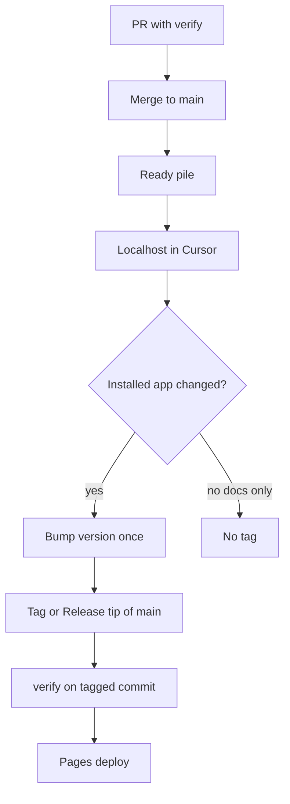

# Promote Simple Liturgy on Tag - Plan

## Goal Capsule

- **Objective:** Merging to `main` no longer updates simpleliturgy.com. Live deploys happen only when someone pushes to prod by tagging / releasing the tip of `main`.
- **Product authority:** Confirmed brainstorm on the promote ritual. Surrounding work (moving private `daily-office-reader` generators into this repo) is not active scope.
- **Open blockers:** None. GitHub branch protection that requires the **verify** check still needs a human (token cannot set it).

## Product Contract

### Summary

Ready work piles on `main` after **verify**. The live site updates only from an explicit GitHub tag / Release of current `main`. Look at that stacked pile on localhost in Cursor before tagging. Bump the installed-app version only when the home-screen PWA would change.

### Problem Frame

Every merge to `main` currently deploys Pages. That makes the ready pile and the store window the same place, so stacked Cursor work cannot land without going live. The installed PWA only needs a new version when the files it caches would change. Docs and CI do not.

### Key Decisions

- KD1. Boring tag / Release promote, not release-please. `(session-settled: user-directed — chosen over release-please: history is already release: deploy, not conventional-commit bot territory.)` Governs R5.
- KD2. `main` is the ready pile, not the live site. `(session-settled: user-directed — chosen over live-on-merge: work can land without going public until an explicit push to prod.)` Governs R1, R2.
- KD3. Push to prod is a GitHub Release / `vX.Y.Z` tag of current `main`. `(session-settled: user-directed — chosen over a production branch or Actions-only button: typical OSS, always ships tip of main.)` Governs R5, R6.
- KD4. Version only when the installed app would change. `(session-settled: user-directed — chosen over version-every-PR: docs, CI, and scripts the phone never loads do not bump.)` Governs R3, R4.
- KD5. Pre-promote look is Cursor screenshots plus localhost port forwarding. `(session-settled: user-directed — chosen over a hosted staging URL or phone-after-tag as the only look.)` Governs R7.

### Actors

- A1. Maintainer (Parker / Cursor) who merges PRs, looks at `main` locally, bumps when needed, and tags.
- A2. GitHub Actions **verify** and Pages deploy.
- A3. Installed home-screen PWA on a phone, which only sees a new cache after a versioned live deploy.

### Requirements

**Ready pile**

- R1. A merge to `main` must not deploy GitHub Pages.
- R2. After a live ship, later `main` commits must leave simpleliturgy.com on the last promoted release until the next tag.

**Versioning**

- R3. Bump `APP_VERSION` and every lockstep `?v=` / service-worker cache name only when the promote would change files the installed app loads (reader, CSS, worker, icons, office or reading data).
- R4. Several app PRs may share one later version. Docs-only or CI-only piles need no bump and no promote.

**Push to prod**

- R5. Publishing a GitHub Release or pushing tag `vX.Y.Z` on the tip of `main` is the promote action.
- R6. The tagged commit must run **verify** before Pages deploy. A tag that does not match `v${APP_VERSION}` must fail that gate.

**Pre-promote look**

- R7. The prescribed look at stacked `main` is a local static server, Cursor port forwarding, and screenshots. It is not a hosted staging URL, and it is not a required phone check before the tag.

### Key Flows

- F1. Land work without going live
  - **Trigger:** A PR is ready.
  - **Actors:** A1, A2
  - **Steps:** **verify** is green; merge to `main`; live site stays on the last tag.
  - **Covered by:** R1, R2
- F2. Look, then push to prod
  - **Trigger:** Maintainer wants the piled `main` live.
  - **Actors:** A1, A2, A3
  - **Steps:** Serve current `main` locally and look in Cursor; if installed-app files changed since the last tag, bump once; tag / Release `vX.Y.Z`; **verify** then deploy that commit.
  - **Covered by:** R3, R4, R5, R6, R7
- F3. Docs-only pile
  - **Trigger:** Only files the phone never loads landed since the last tag.
  - **Actors:** A1
  - **Steps:** No version bump; no tag; live site unchanged.
  - **Covered by:** R4

### Acceptance Examples

- AE1. Merge does not ship
  - **Covers R1.**
  - **Given:** Live site is `0.3.143`.
  - **When:** A docs or reader PR merges to `main` with no tag.
  - **Then:** simpleliturgy.com still serves `0.3.143`.
- AE2. Tag ships tip of main
  - **Covers R5, R6.**
  - **Given:** `main` is the intended ship, `APP_VERSION` is `0.3.144`, and **verify** is green.
  - **When:** Tag `v0.3.144` is pushed or that Release is published.
  - **Then:** Pages deploys that commit.
- AE3. Wrong tag fails
  - **Covers R6.**
  - **Given:** `APP_VERSION` is `0.3.144`.
  - **When:** Tag `v0.3.999` is pushed.
  - **Then:** **verify** fails and Pages does not update.
- AE4. Shared version
  - **Covers R3, R4.**
  - **Given:** Two reader PRs merged after `0.3.143` with no bump.
  - **When:** Maintainer promotes.
  - **Then:** One bump to `0.3.144` and one tag `v0.3.144` cover both.

### Success Criteria

- A Cursor Cloud website PR can merge to `main` without changing the live PWA.
- A maintainer can push to prod by tagging current `main` after a localhost look in Cursor.
- **verify** still blocks bad merges and bad tags.

### Scope Boundaries

- No release-please bot.
- No `production` branch and no Actions-only button as the promote path.
- No hosted staging site.
- Phone / existing-profile service-worker upgrade is not a required pre-tag gate. Localhost does not replace that risk.
- Moving `daily-office-reader` generators into this repo is out of this contract.

### Dependencies / Assumptions

- GitHub Pages stays on the GitHub Actions deploy path already used by `.github/workflows/pages.yml`.
- Creating a GitHub Release that also creates `vX.Y.Z` may fire both the tag-push and release events; one deploy concurrency group is enough.
- Branch protection requiring **verify** on `main` is still a human GitHub setting.

### Outstanding Questions

- Deferred to Planning: none remaining. Tag glob is `v*.*.*`. The deploy workflow has no `workflow_dispatch` path. `scripts/bump-version.mjs` ships with the ritual docs.

### Sources / Research

- `.github/workflows/pages.yml` currently deploys on every `main` push after **verify**.
- `.github/workflows/ci.yml` already runs **verify** on pull requests.
- `scripts/check-site.mjs` already enforces production channel and version lockstep.
- `version.js` `APP_VERSION` / `APP_CHANNEL` must stay aligned with HTML `?v=` query strings and `service-worker.js` cache `daily-office-reader-v${APP_VERSION}`.
