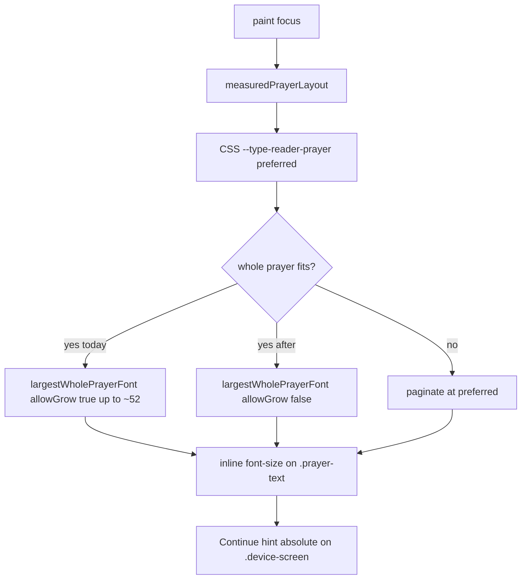

# feat: Typography compare artifact and collect size clamp

## Goal Capsule

- **Objective:** Give a branch-local typography compare surface that makes collect/prayer body size variability obvious (current vs proposed), keeps the Continue footer visible, and ship a modest live clamp so collects stop growing past the type token.
- **Authority:** Confirmed scoping in this planning session; Product Contract below.
- **Stop when:** A local compare HTML on the feature branch shows current vs capped focus chrome with Continue; live `--type-reader-prayer` reader max is tightened; collect fit no longer grows above the CSS preferred size; `scripts/check-site.mjs` guards the no-grow collect policy; the compare file is not presented as a staging or production look surface.
- **Out of capsule:** Redesigning the whole type scale; changing noonday/scripture tokens; publishing a public design-system page; production promote.

---

## Product Contract

### Summary

Build a **branch-local** typography compare artifact (open on the branch, not via staging look URLs) that shows reader collect body text and the Continue footer under current vs proposed sizing. In the same work, cap live collect fitting so size stays at/below the prayer type token, with a modest lower max on the reader prayer token for consistency.

Product Contract created in this planning session (`product_contract_source: ce-plan-bootstrap`).

### Problem Frame

Collect focus text feels inconsistently huge across prayers and viewports. Tokens already use `clamp()`, but short collects can still jump large because `measuredPrayerLayout` grows via `largestWholePrayerFont(..., allowGrow=true)` up to about `min(52px, availableHeight/2)`, past the CSS preferred size. Large type also crowds the focus area reserved for the Continue hint. The user wants a clear local simulation before/while tightening that behavior — not a staging design-system page.

### Key Decisions

- KD1. Review surface is a local branch artifact, not a staging-published design-system page. `(session-settled: user-directed — chosen over staging simulation URL: review on the branch locally.)` Governs R1, R2, R10.
- KD2. Same work ships a live collect size clamp (token + fit policy), not artifact-only preview. Governs R5, R6, R7.
- KD3. Compare artifact must include Continue footer chrome so size and footer are judged together. Governs R3, R4.
- KD4. Scope the JS grow fix to daily-office collect fitting; Lord’s Prayer already uses no-grow; do not retune noonday/scripture tokens in this pass. Governs R6, R9.

### Actors

- A1. Maintainer reviewing typography on a feature branch locally.
- A2. Reader of Simple Prayer / Traditional Prayer collect focus after the clamp merges to the ready pile.

### Requirements

**Local compare artifact**

- R1. Feature branch includes a static HTML compare artifact that can be opened locally (file or local static server) without using staging look URLs for this review.
- R2. Artifact is not wired into the app shell, service-worker SHELL, version bump targets, or smoke path list as a first-class reader surface.
- R3. Artifact renders focus-like chrome: section label, `.prayer-text` body sample(s), and `.focus-continue-hint` “Continue”, using live `design-tokens.css` / `app.css` classes where practical.
- R4. Artifact contrasts **current** vs **proposed** sizing for at least one short collect (today’s grow/oversize case) and notes long/multi-page behavior; Continue stays visible in both columns/panels.

**Live clamp**

- R5. Lower the live reader `--type-reader-prayer` maximum (`.reader .device-screen` today tops at 42px) to a modest consistent ceiling; keep landscape short-height override at or below that ceiling.
- R6. Collect focus fitting must not grow font-size above the CSS preferred `--type-reader-prayer` size (align with Lord’s Prayer no-grow posture for whole-prayer fit).
- R7. After clamp, Continue remains visible on collect focus (existing focus `padding-bottom` reserve continues to clear the hint).
- R8. Gloria may ride the shared `.prayer-text` token; no separate Gloria token. Timed-office `.noonday-text` / scripture tokens stay out of scope unless a shared rule forces a touch.
- R9. Lord’s Prayer remains shrink-only from its preferred size; do not introduce a private Lord’s Prayer type token.

**Ship hygiene**

- R10. The compare artifact must not be treated as pre-promote look, staging verification, or live-site check. If it would merge to `main`, it remains an unlinked docs/dev aid at most — never the surface given for staging look.
- R11. Live token/fit changes that ship on the ready pile follow existing version-bump and promote rules when promoted; this plan does not authorize a production tag.

### Key Flows

- F1. Local compare review
  - **Trigger:** Maintainer opens the branch artifact locally.
  - **Steps:** See current vs proposed collect samples with Continue → judge max size → proceed to live clamp values reflected in the “proposed” panel.
  - **Covered by:** R1, R3, R4
- F2. Short collect after clamp
  - **Trigger:** Reader opens Prayer focus for a short collect.
  - **Steps:** Fitted size stays ≤ CSS preferred; Continue visible; no ~52px grow.
  - **Covered by:** R5, R6, R7
- F3. Long collect after clamp
  - **Trigger:** Reader opens a collect that still needs pagination at the preferred size.
  - **Steps:** Pages at preferred size; Continue advances pages; remap after layout still coherent.
  - **Covered by:** R5, R6, R7

### Acceptance Examples

- AE1. Covers F1. Opening the branch artifact locally shows side-by-side current vs proposed with Continue on both.
- AE2. Covers F2. A short Proper collect that previously grew large paints at ≤ the new preferred max; Continue remains on-screen.
- AE3. Covers F3. A long collect still paginates; Continue advances; no grow above preferred on page 1.

### Scope Boundaries

**In scope**

- Branch-local typography compare HTML
- `--type-reader-prayer` reader/landscape ceilings
- Collect `measuredPrayerLayout` / `largestWholePrayerFont` grow policy
- Continue visibility as part of compare + post-clamp collect focus
- Characterization asserts in `scripts/check-site.mjs` for the no-grow collect policy

**Out of scope**

- Staging-hosted design-system page or staging URL as the review mechanism
- Full type-scale redesign; noonday/scripture token retunes
- Production promote / tagging

### Deferred to Follow-Up Work

- Broader design-token documentation site if the team wants a permanent public styleguide
- Optional feast+About crowding polish beyond verifying Continue still clears

---

## Planning Contract

### Assumptions

- Clearest live fix is **no grow above CSS preferred** for collects (same posture as Lord’s Prayer), plus lowering the reader prayer max from 42px toward the existing non-reader/landscape ceiling (**34px** recommended starting point; adjust only if the local artifact proves too tight).
- Compare artifact path: `docs/design/typography-compare.html` on the feature branch. Prefer **not merging that file to `main`** (or delete before merge) so staging tree sync does not publish a stray HTML surface; live clamp files merge without it.
- User “do what’s clearer” authorized the agent to pick the above over artifact-only preview.

### Key Technical Decisions

- KTD1. Review via branch-local HTML artifact under `docs/design/`, opened locally — not staging look URLs. `(session-settled: user-directed — chosen over staging simulation: local branch artifact only.)` Implements R1, R2, R10.
- KTD2. Cap collect whole-prayer fit with `allowGrow=false` (or equivalent) so preferred CSS size is the ceiling; do not rely on CSS clamp alone. Implements R6. Addresses the real variability source (`grownCeiling` up to ~52).
- KTD3. Lower `.reader .device-screen` `--type-reader-prayer` max to **34px** initially (match root/landscape ceiling); keep landscape override ≤ that max. Implements R5. Tune only if artifact samples prove unreadably small.
- KTD4. Artifact panels: (A) current behavior notes — CSS preferred + grow-capable ceiling; (B) proposed — capped preferred + no grow, with Continue and focus padding reserve. Prefer static CSS demonstration of proposed caps; document that live grow is JS and is fixed in U2. Implements R3, R4.
- KTD5. Do not add the artifact to `service-worker.js` SHELL, `scripts/bump-version.mjs`, or `SMOKE_PATHS`. Implements R2.
- KTD6. Gate the collect no-grow policy in `scripts/check-site.mjs` (string/structural assert on the collect measure path), mirroring Lord’s Prayer token-sharing asserts. Implements R6, R9.

### High-Level Technical Design

### Alternative Approaches Considered

| Approach | Why not |
|---|---|
| Artifact-only, no live clamp | Leaves the variability bug in the reader; less clear outcome for the branch |
| CSS max only, leave JS grow | Grow still exceeds token; inconsistency remains |
| Staging design-system page | Rejected by user; confuses pre-promote look |
| Cap the magic `52` constant only | Weaker than aligning ceiling to CSS preferred; two sources of truth |

### Risks & Dependencies

| Risk | Mitigation |
|---|---|
| Merge of compare HTML publishes unlinked page on staging | Keep artifact feature-branch-only or omit from main merge; never cite it as staging look |
| Lower preferred changes multi-page collect breaks / remap | Verify long collect Continue index after layout (F3 / AE3) |
| Feast About link reduces available height | Spot-check one feast collect with links on |
| Lord’s Prayer preferred drops with shared token | Accept shared ceiling; keep no-grow + no private LP token (R9) |

### System-Wide Impact

- **Readers:** Short collects look more consistent; fewer oversized pages crowding Continue.
- **Maintainers:** Local artifact for type decisions; staging look remains the real reader after merge of clamp only.
- **Promote path:** Unchanged — clamp merge → staging look on real surfaces → promote only with admin approval + live-site check.

---

## Implementation Units

### U1. Branch-local typography compare artifact

- **Goal:** Add a local HTML compare surface on the feature branch showing current vs proposed collect typography with Continue visible.
- **Requirements:** R1, R2, R3, R4, R10; KTD1, KTD4, KTD5
- **Dependencies:** None
- **Files:** `docs/design/typography-compare.html` (create); optionally tiny scoped styles in that file only
- **Approach:**
  1. Scaffold two panels that reuse reader classes (`.device-screen` / `.reader` / `.prayer-text` / `.focus-continue-hint` / label) and link `design-tokens.css` + `app.css` with relative paths appropriate from `docs/design/`.
  2. Panel A documents current reader preferred max (42px) and that live JS may grow above it; Panel B applies proposed max (34px) via a local override on that panel only. Note in Panel A (and the HTML header comment) that live JS grow above preferred is fixed in U2, per KTD4 — the artifact’s static CSS panels do not replace that fix.
  3. Include a short collect sample (e.g. Proper-length) and a longer sample or note; both panels show Continue with focus padding reserve.
  4. Do not register the file in SW / bump-version / smoke paths. README blurb in the HTML header comment: open locally; not a staging look surface; prefer omit from `main` merge.
- **Execution note:** Smoke-first — open the file locally (or local static server) and confirm both panels before touching live fit code.
- **Patterns to follow:** Static HTML wiring like `privacy.html` / `terms.html` for CSS links, but keep the file under `docs/design/` and out of shell lists.
- **Test scenarios:**
  - Happy path: open artifact locally → both panels show label, prayer body, and Continue.
  - Edge: narrow mobile-width viewport → proposed panel body ≤ proposed max and Continue still on-screen.
  - Integration: artifact is not listed in `service-worker.js` SHELL or `SMOKE_PATHS`.
- **Verification:** Local open matches AE1; no shell/smoke wiring.

### U2. Live collect clamp (token + no-grow fit)

- **Goal:** Tighten reader prayer max and stop collect fit from growing above CSS preferred.
- **Requirements:** R5, R6, R7, R8, R9; KTD2, KTD3, KTD6
- **Dependencies:** U1 (proposed values validated on the artifact)
- **Files:** `design-tokens.css`; `app.js` (`largestWholePrayerFont` call from `measuredPrayerLayout` / grow policy); `scripts/check-site.mjs` (characterization)
- **Approach:**
  1. Set `.reader .device-screen` `--type-reader-prayer` max to 34px; confirm landscape short-height clamp stays ≤ 34px.
  2. Change collect whole-prayer measurement to no-grow (`allowGrow=false` or equivalent) so preferred CSS size is the ceiling; leave Lord’s Prayer path no-grow; do not invent `--type-reader-lords-prayer`.
  3. Do not change `--type-reader-noonday` / scripture tokens.
  4. Add `check-site` asserts that collect measurement uses no-grow (and existing Lord’s Prayer shared-token asserts still pass).
- **Execution note:** Prefer characterization assert for the grow call site before/with the behavior change.
- **Patterns to follow:** Lord’s Prayer `allowGrow=false` call; existing `check-site` Lord’s Prayer token-sharing asserts.
- **Test scenarios:**
  - Covers AE2. Short collect: fitted inline `font-size` ≤ computed preferred; Continue visible.
  - Covers AE3. Long collect: paginates at preferred; Continue advances; no grow above preferred.
  - Edge: landscape short-height — prayer max ≤ 34px; Continue clear.
  - Edge: Lord’s Prayer still shrink-only; no private LP token (existing asserts).
  - Integration: `node scripts/check-site.mjs` passes with new no-grow assert.
- **Verification:** AE2/AE3 on local app; check-site green; artifact Panel B matches shipped token max.

### U3. Merge hygiene for artifact vs ready pile

- **Goal:** Land the live clamp without treating the compare HTML as a staging look surface.
- **Requirements:** R10, R11; KTD1, KTD5
- **Dependencies:** U1, U2
- **Files:** PR description / merge contents only (omit or delete `docs/design/typography-compare.html` from the `main` merge if present); no new staging workflow changes required
- **Approach:**
  1. Ship `design-tokens.css` + `app.js` + `check-site` on the ready pile.
  2. Keep compare HTML feature-branch-only when practical; if it must merge, leave it unlinked and never cite it in staging look instructions.
  3. After clamp merge, pre-promote look uses real reader URLs on staging — not the compare file.
- **Test expectation:** none -- process/merge hygiene; no new runtime behavior beyond U2.
- **Verification:** PR/merge does not advertise a staging design-system URL; staging look points at reader surfaces per `AGENTS.md` / `CONCEPTS.md`.

---

## Verification Contract

- Local: open `docs/design/typography-compare.html` from the feature branch (AE1).
- Local app: short + long collect focus after U2 (AE2, AE3); landscape spot-check; Continue visible.
- Gate: `node scripts/check-site.mjs`.
- After merge of clamp: staging look on https://staging.simpleliturgy.com/ reader surfaces (not the compare artifact). Production tag only with admin verbal approval + live-site check — out of this plan’s execution.

## Definition of Done

- [ ] U1 artifact exists on the feature branch and shows current vs proposed with Continue
- [ ] U2 token max + collect no-grow shipped; check-site asserts the policy
- [ ] U3 merge hygiene: compare file not used as staging/production look
- [ ] Acceptance examples AE1–AE3 satisfied
- [ ] No production tag as part of this work

## Sources & Research

- Repo patterns: `design-tokens.css` prayer clamps; `app.css` `.prayer-text` / `.focus-continue-hint`; `app.js` `measuredPrayerLayout` / `largestWholePrayerFont`; `bookmark-engine.js` `readerProgressHintHtml`; staging full-tree sync via `scripts/prepare-staging-tree.mjs`
- Institutional: `docs/solutions/conventions/promote-requires-live-hostname-check.md`; `CONCEPTS.md` release-path vocabulary
- External research: skipped — local patterns sufficient
- Slack tools available; not searched (opt-in)
